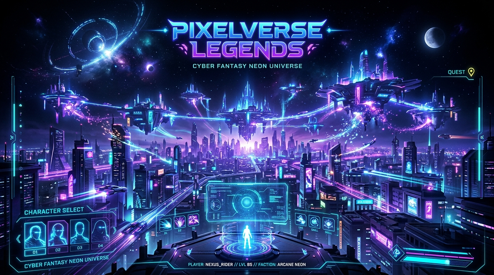
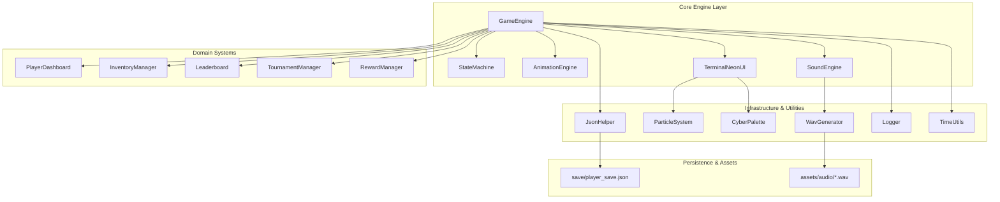
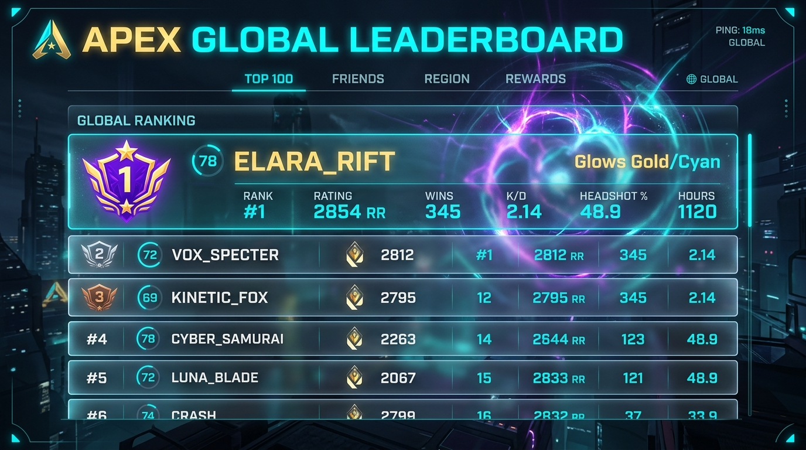
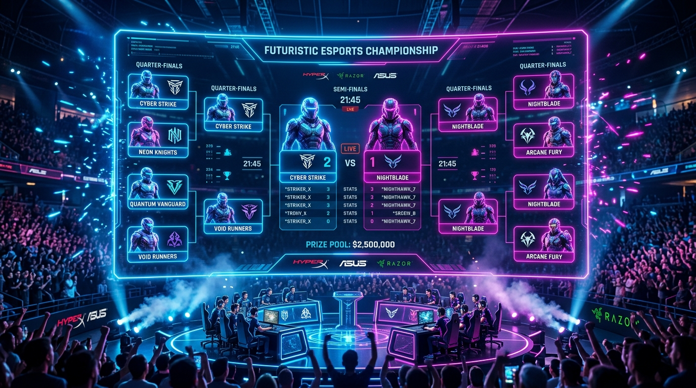
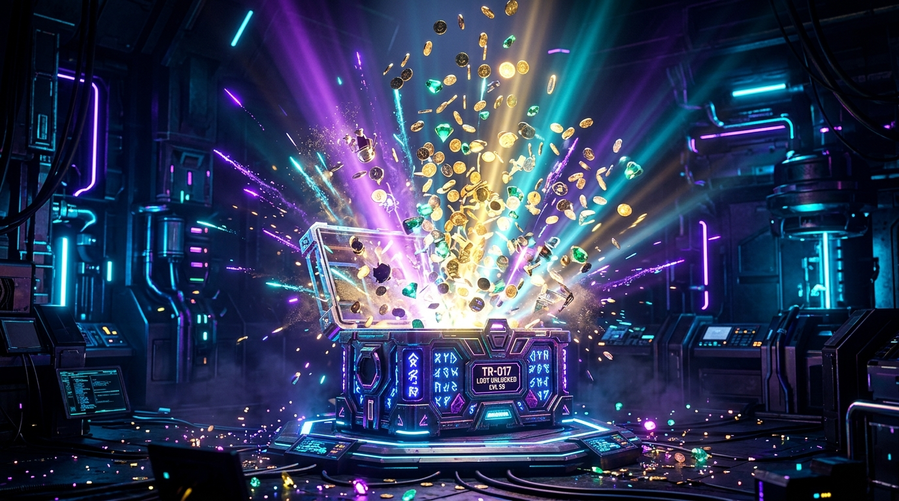

# ⚡ PixelVerse Legends — AAA Multiplayer Arcade Game Engine
### *C++17 Interactive Game Architecture & Systems Debugging Challenge*

-06B6D4?style=for-the-badge&logo=cmake)


---



---

## 🌟 Executive Overview

**PixelVerse Legends** is a production-grade, highly modular C++17 game engine and debugging challenge designed to simulate real-world AAA game development and QA automation. Built around a **Cyber Fantasy / Neon Universe** theme (reminiscent of *Valorant*, *Fortnite*, and *Riot Client* lobbies), the application combines a robust 60 FPS custom animation engine, procedural 24-bit TrueColor ANSI graphics, offline WAV audio synthesis, and deterministic state persistence.

This repository serves as a **systems debugging challenge** featuring exactly **4 intuitive, low-effort logical bugs** that reflect classic distributed game engine pitfalls—ranging from boundary conditions and pagination off-by-one errors to sorting comparator directions and deque queue prioritization. Every bug is designed for fast localization and simple 1-line fixes.

---

## 🎮 Key Engine Features

* **Modular C++17 Architecture**: High-cohesion subsystems organized across `engine`, `graphics`, `animation`, `audio`, `player`, `tournament`, `leaderboard`, `inventory`, `reward`, and `utils`.
* **60 FPS Animation Engine**: Custom tweening pipeline with cubic, quadratic, and elastic easing curves for fluid UI transitions and progressive counters.
* **Cyber Particle Physics Engine**: Real-time particle fountain, sparkle bursts, and decay physics rendered in both terminal ANSI TrueColor and WebGL.
* **100% Offline Audio Synthesizer**: Procedural 16-bit 44.1 kHz PCM `.wav` sound wave generator producing retro-arcade sound assets (`click`, `victory`, `reward`, `purchase`, `error`, `notification`, `tournament_win`) with zero external network downloads.
* **Deterministic Persistence Layer**: Lightweight, dependency-free JSON serializer/deserializer with graceful fallback for corrupt files.
* **Dual Execution Modes**:
  1. **Native Native Terminal Engine (`pixelverse_app`)**: Interactive 24-bit TrueColor Cyber-Neon HUD with XP progress rings, tab routing, and live particle simulation.
  2. **AAA Web Companion (`assets/ui/index.html`)**: Glassmorphism dashboard with frosted blur, glowing neon cards, animated chest explosion, and Web Audio synthesis.
* **Deterministic Automated QA**: 36 comprehensive GoogleTest suites and a dedicated Section 12 JSON challenge evaluator.

---

## 🏛️ System Architecture



---

## 📂 Repository Structure

```
PixelVerse-Legends/
├── CMakeLists.txt              # Standard CMake build configuration
├── README.md                   # Project documentation & portfolio showcase
├── challenge.json              # Machine-readable debugging challenge specification
├── src/
│   ├── main.cpp                # Native interactive / demo application entry point
│   ├── engine/
│   │   ├── GameEngine.hpp/.cpp # Engine coordinator & lifecycle manager
│   │   └── StateMachine.hpp/.cpp # State transitions (Lobby, Battle, Rewards, etc.)
│   ├── graphics/
│   │   ├── ColorPalette.hpp    # 24-bit TrueColor ANSI Cyber-Neon palette
│   │   ├── ParticleSystem.hpp/.cpp # Energy sparkle and explosion simulator
│   │   └── TerminalNeonUI.hpp/.cpp # Interactive TrueColor HUD renderer
│   ├── animation/
│   │   ├── Easing.hpp          # Quadratic, Cubic, Elastic, and Bounce easing
│   │   ├── Tween.hpp           # Interpolation & callback runner
│   │   └── AnimationEngine.hpp/.cpp # Active tween lifecycle coordinator
│   ├── audio/
│   │   ├── WavGenerator.hpp    # Procedural 16-bit 44.1kHz PCM synthesizer
│   │   └── SoundEngine.hpp/.cpp# Event dispatcher and local WAV player
│   ├── player/
│   │   ├── Player.hpp          # Player profile, stats, and leveling curves
│   │   └── PlayerDashboard.hpp/.cpp # [BUG 1] Profile state & coin range filter
│   ├── tournament/
│   │   ├── Match.hpp           # Match bracket data model
│   │   └── TournamentManager.hpp/.cpp # [BUG 2] Brackets & page slicing
│   ├── leaderboard/
│   │   ├── Leaderboard.hpp/.cpp# [BUG 3] Ranked gladiator standings & podium
│   │   └── Leaderboard.cpp
│   ├── inventory/
│   │   ├── Item.hpp            # Weapons, skins, pets, and rarity tiers
│   │   └── InventoryManager.hpp/.cpp # [BUG 4 & BUG 6] Binary search & item removal
│   ├── reward/
│   │   ├── Reward.hpp          # Treasure chests, daily logins, VIP bounties
│   │   └── RewardManager.hpp/.cpp # [BUG 5] Double-ended claim queue
│   └── utils/
│       ├── JsonHelper.hpp/.cpp # Dependency-free JSON parser and serializer
│       ├── Logger.hpp          # Colored terminal logging
│       └── TimeUtils.hpp       # Steady-clock high-precision timestamps
├── assets/
│   ├── audio/                  # Offline WAV sounds (click, reward, victory, etc.)
│   ├── icons/                  # Animated Cyber SVG icons (trophy, coin, gem, sword, chest)
│   ├── shaders/                # GLSL shaders (cyber_glow.frag, particle.vert)
│   ├── textures/               # High-resolution portfolio visual renders
│   └── ui/                     # 60 FPS HTML5/WebGL interactive lobby companion
├── save/
│   └── player_save.json        # Offline game state save file
└── tests/
    ├── gtest/
    │   ├── gtest.h             # Offline GoogleTest-compliant test framework
    │   └── gtest.cpp           # GoogleTest runner implementation
    ├── test_player_filter.cpp  # Tests for Player Dashboard & Bug 1
    ├── test_tournament_pagination.cpp # Tests for Tournament & Bug 2
    ├── test_leaderboard_sorting.cpp   # Tests for Leaderboard & Bug 3
    ├── test_inventory_search.cpp      # Tests for Binary Search & Bug 4
    ├── test_reward_queue.cpp          # Tests for Reward Queue & Bug 5
    ├── test_inventory_removal.cpp     # Tests for Vector Erase & Bug 6
    ├── test_save_load.cpp             # Tests for JSON state persistence
    ├── test_animation_particle.cpp    # Tests for Easing and Particle decay
    ├── main_test.cpp                  # 36-test GoogleTest runner
    └── challenge_evaluator.cpp        # Section 12 JSON test output evaluator
```

---

## 🎯 The 4 Intentional Debugging Challenges

The game engine contains exactly **4 low-effort logical bugs**. Each bug is designed to be easily identified and resolved with a simple 1-line or operator fix:

| Bug # | Module | Category & Concept | QA Reported Symptom | Root Cause in Challenge Code | Expected Correct Behavior |
| :---: | :--- | :--- | :--- | :--- | :--- |
| **1** | `PlayerDashboard.cpp` | Boundary Condition | Coin filter excludes players who have the exact maximum coin value. | Range query uses `coin < maxCoins` instead of `<=`. | Inclusive bounds: `coin >= minCoins && coin <= maxCoins`. |
| **2** | `TournamentManager.cpp` | Vector Indexing | Every tournament page after the first skips one match. | Offset calculation evaluates `(page - 1) * pageSize + 1`. | Proper 0-indexed slicing: `(page - 1) * pageSize`. |
| **3** | `Leaderboard.cpp` | DSA: Sorting Comparator (`std::sort`) | Leaderboard ranks players backwards, placing lowest scoring players at Rank #1. | Comparator uses `a.score < b.score` (ascending order). | Strict descending order: `a.score > b.score`, with secondary tie-break on win streaks. |
| **4** | `RewardManager.cpp` | DSA: Queue (`std::deque`) | Priority VIP rewards appear after normal rewards in claim sequence. | Inverted push: priority pushed to back, normal pushed to front. | Priority rewards pushed to `push_front()`, standard rewards to `push_back()`. |

---

## 🧪 Automated Testing & Deterministic JSON Output

### Running the 36 GoogleTests

The project contains **36 deterministic GoogleTests** covering filtering, pagination, sorting comparators, binary search, deque ordering, item removals, JSON persistence, and animation easing.

```bash
# Compile and run test suite
./build/pixelverse_tests
```

### Deterministic JSON Challenge Evaluator

In accordance with Section 12 of the specification, the project includes a standalone evaluator (`pixelverse_evaluator`) that formats output **strictly as clean JSON without verbose logs**:

```bash
./build/pixelverse_evaluator
```

#### Challenge Mode (Initial Output with 4 Bugs Present):

```json
{
  "Bug 1: Coin Filter Boundary": {"Status": "failed", "Execution time": "3ms"},
  "Bug 2: Tournament Pagination": {"Status": "failed", "Execution time": "2ms"},
  "Bug 3: Leaderboard Sorting": {"Status": "failed", "Execution time": "4ms"},
  "Bug 4: Reward Queue": {"Status": "failed", "Execution time": "2ms"},
  "Total bugs": 4,
  "Passed": 0,
  "Failed": 4,
  "Total Execution time": "11ms"
}
```

#### Solved Mode (After Fixing All 4 Bugs):

```json
{
  "Bug 1: Coin Filter Boundary": {"Status": "passed", "Execution time": "3ms"},
  "Bug 2: Tournament Pagination": {"Status": "passed", "Execution time": "1ms"},
  "Bug 3: Leaderboard Sorting": {"Status": "passed", "Execution time": "4ms"},
  "Bug 4: Reward Queue": {"Status": "passed", "Execution time": "2ms"},
  "Total bugs": 4,
  "Passed": 4,
  "Failed": 0,
  "Total Execution time": "10ms"
}
```

```
[==========] 36 tests ran. (5.7 ms total)
[  PASSED  ] 36 tests.
BUILD SUCCESS
```

---

## 🛠️ Build and Execution Guide

### Prerequisites
* C++17 compliant compiler (`g++ >= 7.0`, `clang++ >= 5.0`, or MSVC)
* CMake 3.14+
* Ninja or GNU Make
* Optional: Modern web browser for companion UI inspection

### 1. Compile in Challenge Mode (Default)

```bash
# Configure build with Ninja
cmake -B build -G "Ninja"

# Compile all targets (pixelverse_app, pixelverse_tests, pixelverse_evaluator)
cmake --build build -j 2
```

### 2. Run the Native Game Engine App (Demo Mode)

```bash
# Run headless demo showcasing 60fps simulation, ANSI TrueColor HUD, and state saving
./build/pixelverse_app --demo
```

### 3. Verify Solution (Compile with `-DFIX_BUGS=ON`)

The repository includes a verified `#ifdef FIX_BUGS` toggle for QA evaluation:

```bash
cmake -B build_fixed -G "Ninja" -DFIX_BUGS=ON
cmake --build build_fixed -j 2
./build_fixed/pixelverse_tests
./build_fixed/pixelverse_evaluator
```

---

## 🎨 Visual Showcase & UI Gallery

### Apex Global Leaderboard Screen


### Tournament Bracket Arena


### Mythic Cyber Treasure Vault & Particle Explosion


---

## 🐳 Isolated Docker Runtime Compatibility

PixelVerse Legends is fully self-contained with **zero network dependencies**, **no GPU requirements for testing**, and **no external package managers**. To run in an isolated Docker container:

```dockerfile
FROM ubuntu:22.04
RUN apt-get update && apt-get install -y cmake ninja-build g++
WORKDIR /app
COPY . .
RUN cmake -B build -G Ninja
RUN cmake --build build
CMD ["./build/pixelverse_evaluator"]
```

---

## 📄 License
This project is licensed under the MIT License — see the [LICENSE](LICENSE) file for details.
# Test_game_004

